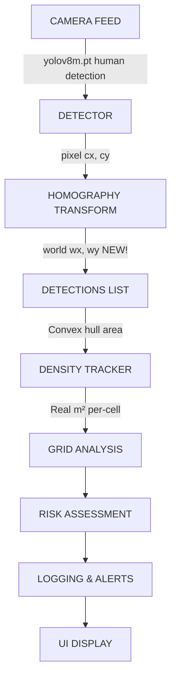
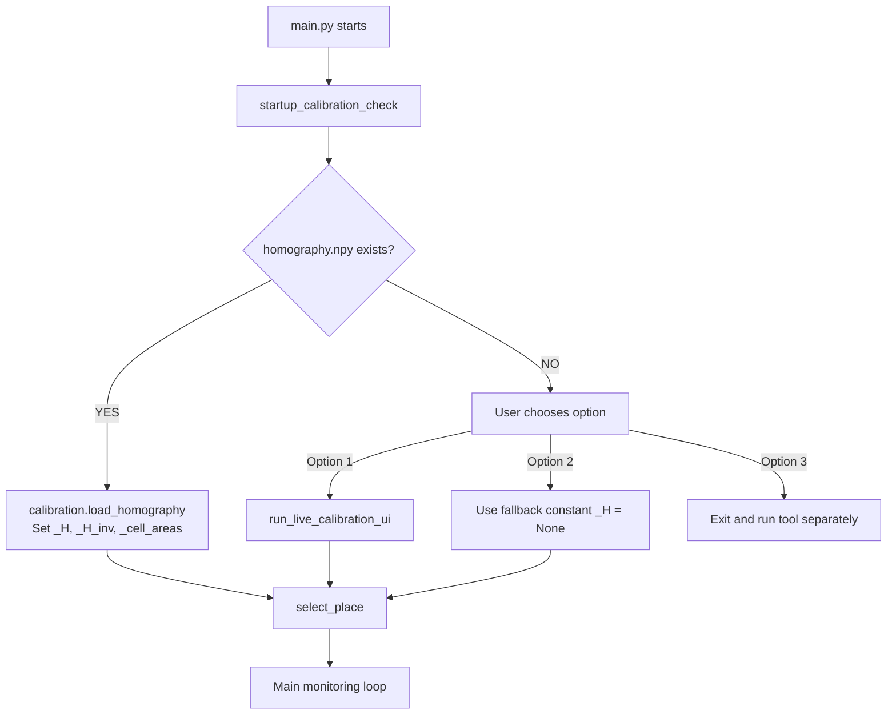
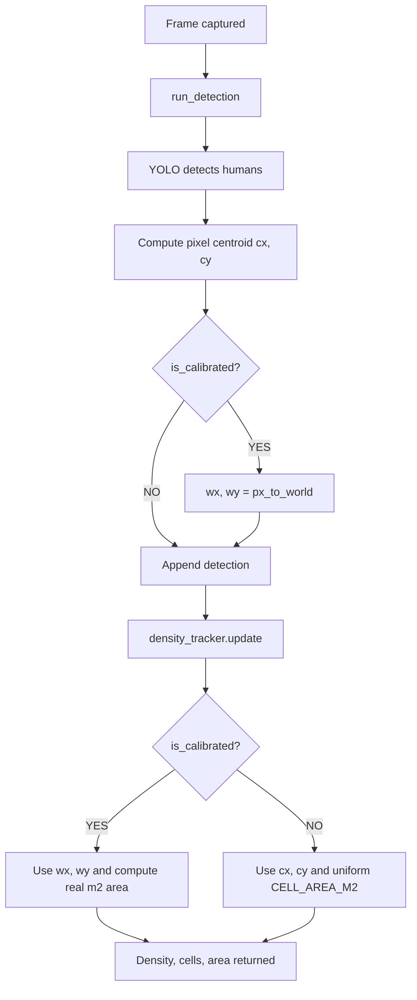
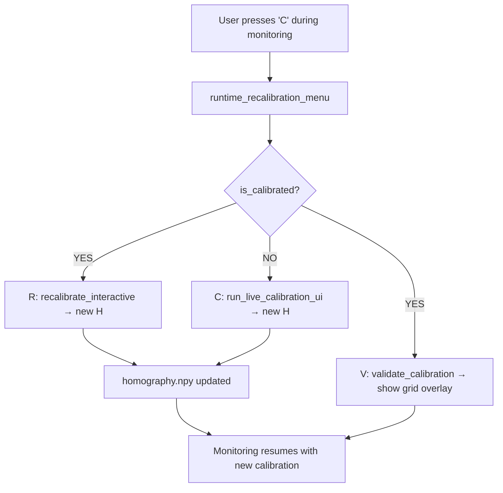

# Ground Plane Calibration — Technical Architecture

## System Overview



---

## Module Breakdown

### 1. `calibration.py` — Homography Engine

**Core Responsibilities:**
- 4-point interactive calibration UI
- Homography matrix computation
- Pixel ↔ World coordinate transforms
- Per-cell real area calculation
- Validation & quality metrics

**Key Functions:**

```python
# CALIBRATION WORKFLOW
run_calibration(frame)              # Interactive 4-point selection
run_live_calibration_ui()           # Full workflow with validation
recalibrate_interactive()           # Runtime recalibration
validate_calibration(frame)         # Show grid overlay & confirm

# COORDINATE TRANSFORMS
px_to_world(pixel_pts)              # N×2 pixels → N×2 metres
world_to_px(world_pts)              # N×2 metres → N×2 pixels
world_to_grid(wx, wy)               # World → (row, col)
cell_area_m2(row, col)              # Real m² of cell

# STATE
_H                                   # 3×3 homography matrix
_H_inv                              # Inverse for world→pixel
_cell_areas[ROWS][COLS]             # Pre-computed cell areas
```

**Calibration Storage:**

```
homography.npy
├─ Shape: (3, 3)
├─ Type: float64
├─ Content: 3×3 homography matrix H
└─ Use: Loaded at startup, never edited manually
```

### 2. `detector.py` — Detection with World Coordinates [UPDATED]

**Core Responsibilities:**
- YOLO human detection
- Occlusion correction
- **NEW:** World coordinate assignment per detection

**Key Changes:**

```python
# BEFORE (original)
detection = {
    'x1': 100, 'y1': 200, 'x2': 150, 'y2': 280,
    'cx': 125, 'cy': 240,
    'row': 1, 'col': 2, 'pid': 42
}

# AFTER (enhanced)
detection = {
    'x1': 100, 'y1': 200, 'x2': 150, 'y2': 280,
    'cx': 125, 'cy': 240,
    'wx': 2.5, 'wy': 1.8,    # ← WORLD COORDINATES (NEW!)
    'row': 1, 'col': 2, 'pid': 42
}
```

**Implementation:**

```python
def run_detection(model, frame, frame_h, frame_w):
    # ... existing YOLO detection ...
    
    if calibration.is_calibrated():
        try:
            world_pt = calibration.px_to_world([(cx, cy)])
            wx, wy = float(world_pt[0, 0]), float(world_pt[0, 1])
        except:
            wx, wy = None, None
    else:
        wx, wy = None, None
    
    detection.append({
        'x1': x1, 'y1': y1, 'x2': x2, 'y2': y2,
        'cx': cx, 'cy': cy, 'wx': wx, 'wy': wy,  # ← NEW
        'row': row, 'col': col, 'pid': pid
    })
```

### 3. `density.py` — Perspective-Corrected Density [UPDATED]

**Core Responsibilities:**
- Compute convex hull of detected crowd
- Calculate real-world area in m²
- Per-cell density with perspective correction

**Key Function:**

```python
def convex_hull_area_m2(detections):
    """
    Returns:
        hull_area_m2: Real floor area (m²)
        hull_pts_px: Pixel coordinates for drawing
        hull_pts_w: World coordinates for analysis
    """
    
    if calibrated:
        # Use world coordinates
        world_pts = [[d['wx'], d['wy']] for d in detections]
        hull_pts_w = cv2.convexHull(world_pts)
        hull_area_m2 = cv2.contourArea(hull_pts_w)  # In m²!
    else:
        # Fallback to pixel space with uniform constant
        pixel_pts = [[d['cx'], d['cy']] for d in detections]
        hull_pts_px = cv2.convexHull(pixel_pts)
        hull_area_m2 = cv2.contourArea(hull_pts_px) * CELL_AREA_M2
```

**Per-Cell Calculation:**

```python
# BEFORE (uniform everywhere)
cell_area = CELL_AREA_M2  # 2.0 m² for all cells

# AFTER (perspective-corrected)
for row, col in grid:
    cell_area = calibration.cell_area_m2(row, col)
    # Cells near camera: smaller area (perspective effect)
    # Cells far from camera: larger area
```

### 4. `main.py` — Main Loop with Recalibration [UPDATED]

**Core Responsibilities:**
- Orchestrate system startup
- Calibration check & optional recalibration
- Main monitoring loop with keyboard controls

**Calibration Workflow:**

```python
def startup_calibration_check():
    """Startup sequence:"""
    
    if homography.npy exists:
        load_homography()
        return True  # Ready to monitor
    
    # Not calibrated - offer options:
    choice = input("[1] Calibrate now | [2] Use fallback | [3] Run calibration_tool.py")
    
    if choice == "1":
        run_live_calibration_ui()
        load_homography()
    elif choice == "3":
        exit(0)  # User should run tool separately
    # else: Use fallback constant
```

**Keyboard Controls:**

```python
while True:
    # ... capture & process frame ...
    
    key = cv2.waitKey(1) & 0xFF
    
    if key == ord('q'):
        break  # Quit
    elif key == ord('c'):
        runtime_recalibration_menu()  # ← NEW!
        # Options: Validate / Recalibrate / Return
```

### 5. `calibration_tool.py` — Interactive GUI [NEW]

**Core Responsibilities:**
- Standalone calibration wizard
- Multi-step guided interface
- Better error handling

**Workflow:**

```
1. Welcome banner
2. Pre-calibration check (existing cal?)
3. Reference rectangle preparation
4. Camera test
5. 4-point selection
6. Validation preview
7. Save homography.npy
```

**Command-line Interface:**

```bash
python calibration_tool.py               # Interactive
python calibration_tool.py --validate    # Validate only
python calibration_tool.py --recalibrate # Force recalibration
```

### 6. Robustness Filters [NEW]

**`head_localizer.py`**: Computes accurate ground-contact points (`fx, fy`) from YOLO bounding boxes.
**`ground_segmentor.py`**: Uses BiSeNetV2 semantic segmentation to automatically generate `MANUAL_ROI`.
**`congestion.py`**: Analyzes per-cell density to generate localized `WARNING` and `CRITICAL` alerts.
**`temporal_filter.py`**: Applies EMA smoothing to grid densities to reduce UI jitter.

---

## Data Flow Diagrams

### Initialization



### Per-Frame Processing



### Recalibration (Runtime)



---

## Transformation Math

### Homography Matrix

```
Given 4 reference points:
  Image space:  p1, p2, p3, p4  (pixels)
  World space:  q1, q2, q3, q4  (metres)

Compute:
  H = cv2.findHomography(
    np.array([p1, p2, p3, p4], dtype=float32),
    np.array([q1, q2, q3, q4], dtype=float32)
  )

Result: 3×3 matrix H such that:
  q = H @ p  (in homogeneous coordinates)
```

### Perspective Transform

```python
# Forward (pixel → world)
pt_homog = np.array([cx, cy, 1])  # Homogeneous coordinates
pt_world_homog = H @ pt_homog      # Matrix multiply
wx = pt_world_homog[0] / pt_world_homog[2]  # Dehomogenize
wy = pt_world_homog[1] / pt_world_homog[2]

# Inverse (world → pixel)
pt_homog = np.array([wx, wy, 1])
pt_px_homog = H_inv @ pt_homog
cx = pt_px_homog[0] / pt_px_homog[2]
cy = pt_px_homog[1] / pt_px_homog[2]
```

### Area Calculation

```
Pixel space hull:
  hull_area_px = cv2.contourArea(hull_pts_px)
  hull_area_m2 = hull_area_px * scale_factor  # Wrong! (scale varies)

World space hull (CORRECT):
  hull_pts_w = calibration.px_to_world(hull_pts_px)
  hull_area_m2 = cv2.contourArea(hull_pts_w)  # Direct m² ✓
```

---

## Configuration Dependencies

```
config.py
├─ CAMERA_INDEX
│  └─ Used in: detector.py (YOLO input)
│              calibration.py (reference frame capture)
│              calibration_tool.py
│
├─ CAPTURE_W, CAPTURE_H
│  └─ Grid layout in calibration.py._precompute_cell_areas()
│
├─ HOMOGRAPHY_FILE
│  └─ Load/save point in calibration.py
│
├─ WORLD_GRID_W, WORLD_GRID_H
│  └─ [CRITICAL] Draw overlay in calibration.draw_world_grid()
│              Define grid extent in calibration.world_to_grid()
│
├─ GRID_ROWS, GRID_COLS
│  └─ Grid division in density.py
│
└─ CELL_AREA_M2
   └─ Fallback if NOT calibrated (used by density.py)
```

---

## Error Handling

### Calibration Failures

```python
# Scenario 1: Points not valid
if H is None:
    raise RuntimeError("Homography computation failed — check your 4 points")

# Scenario 2: Camera cannot be opened
if not cap.isOpened():
    raise RuntimeError("Cannot open camera. Check CAMERA_INDEX")

# Scenario 3: Validation rejected
if not validate_calibration():
    os.remove(HOMOGRAPHY_FILE)
    _H = None
    return False
```

### Transform Errors

```python
# Missing calibration
if _H is None:
    raise RuntimeError("Homography not loaded. Run calibration first.")

# Invalid input
try:
    world_pts = px_to_world(pixel_pts)
except:
    wx, wy = None, None  # Graceful degradation
```

---

## Performance Characteristics

| Operation | Time | Memory | Notes |
|-----------|------|--------|-------|
| Load H from disk | <1ms | ~1KB | One-time at startup |
| px_to_world() per point | <0.1ms | - | O(1) matrix multiply |
| px_to_world(N) for N=100 | ~0.5ms | - | Vectorized |
| Hull area (calibrated) | ~1ms | - | cv2.contourArea() |
| Hull area (fallback) | ~1ms | - | Same O(N) |
| Validation overlay | ~5ms | - | Drawing grid lines |
| Full recalibration | ~2min | - | User interaction |

**Bottleneck:** Per-frame detection (YOLO), not coordinate transforms.

---

## Testing Checklist

- [x] Syntax: No Python errors
- [ ] Functional: Test calibration with actual camera
- [ ] Integration: Verify wx, wy in detections
- [ ] Density: Confirm real m² areas
- [ ] UI: Check grid overlay alignment
- [ ] Runtime: Recalibration during monitoring
- [ ] Fallback: System works without calibration

---

## Future Enhancements

1. **8-Point Calibration** — Higher accuracy with distorted lenses
2. **Auto-Calibration** — Detect checkerboard or grid patterns
3. **Lens Distortion Correction** — Beyond homography (radial distortion)
4. **Multi-Camera Support** — Per-camera homography files
5. **Temporal Tracking** — Smooth velocity in world coordinates
6. **Batch Calibration** — Store multiple environments

---

## Dependencies

```
External:
├─ opencv-python (cv2)
├─ numpy
├─ ultralytics (YOLO)
└─ tkinter (UI dialogs)

Internal:
├─ config.py (constants)
├─ detector.py (detection)
├─ density.py (hull area)
├─ calibration.py (transforms)
└─ calibration_tool.py (GUI)
```

---

**Architecture Version 2.0**  
**Last Updated:** June 2026
